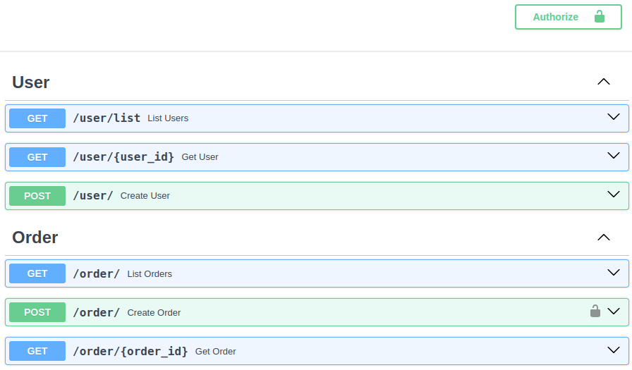
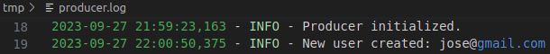
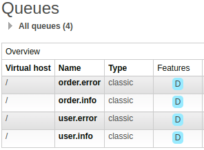
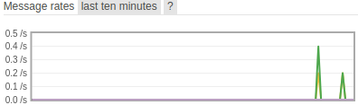
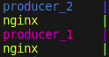

# Message Broker Application

Simple **API architecture** based on a **Producer** and a **Consumer** communicating through a message broker.

The **Producer** API is used to create new *Users* and *Orders*. Then these events are sent to a message broker in order to be evaluated by another service.

The **Consumer** receives and evaluates those events, creating a local log.

The main technologies involved are:
- [x] **FastAPI** as web framework
- [x] **RabbitMQ** as message broker
- [x] **Docker** as environment builder
- [x] **Nginx** as HTTP server

Extra features implemented:
- [x] **SQLAlchemy** as ORM
- [ ] **pytest** as testing framework

## Running via Docker

- Run `sudo docker-compose up --build --force` on the repository root
- Producer's API docs is available on `http://localhost:8000/docs`
- **RabbitMQ** management tool is available on `http://localhost:15772`
- Log of both services are available on Docker's volume `./tmp`

## Results

* **FastAPI** application with *logging* system.
 
 

* **RabbitMQ** as message broker.
 
 

* **Nginx** applied as a reverse proxy, performing load balancing between two API instances.
 